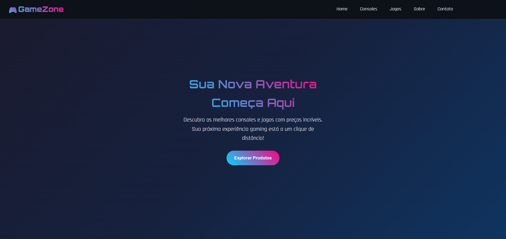
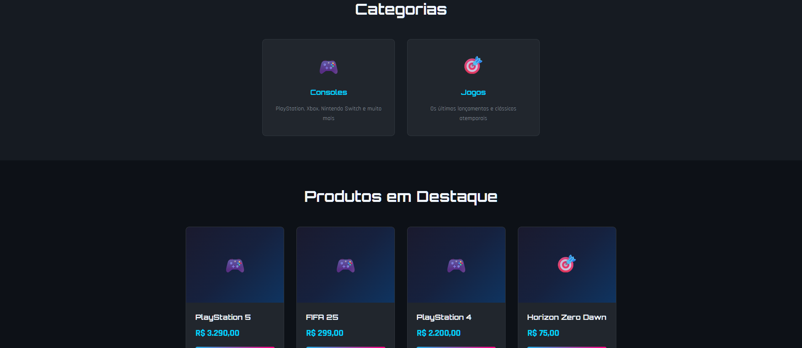
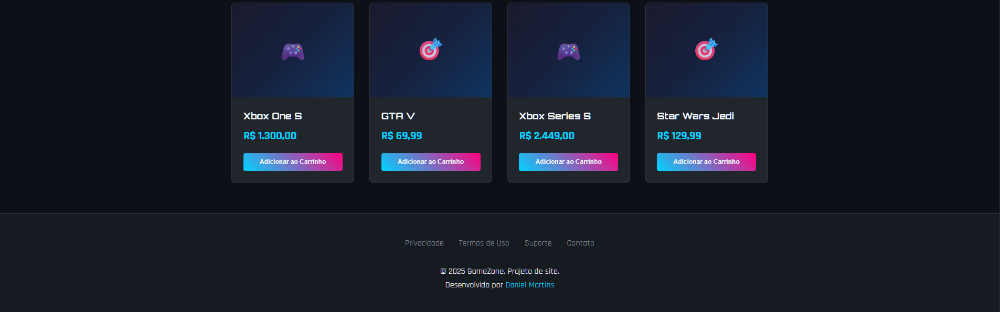

# 🎮 GameZone
**GameZone** é uma loja fictícia voltada ao universo gamer, desenvolvida para apresentar produtos em destaque como consoles e jogos. O projeto combina HTML5 e CSS3 com uma pegada visual futurista e responsiva — perfeito para quem curte design imersivo e moderno.

---

## 📸 Demonstração

### Preview da Home

  

### Preview das Categorias

  

### Preview dos Produtos

---

## 🧩 Funcionalidades
- Navegação por seções: Home, Consoles, Jogos, Sobre, Contato  
- Cards de produtos com preço e botão de ação  
- Layout responsivo para diferentes tamanhos de tela  
- Estilização com gradientes, variáveis CSS e efeitos hover  
- Estrutura pensada para futuras interações via JavaScript  

---

## 🚧 Em Desenvolvimento
Este projeto está sendo aprimorado e a próxima etapa será a implementação da parte JavaScript, incluindo:
- Interação com carrinho de compras  
- Filtros de busca e categorias  
- Animações e notificações interativas  
- Validação de formulários e integração futura com backend  

---

## 🎨 Tecnologias Utilizadas
- **HTML5** semântico  
- **CSS3** moderno com:
  - Variáveis (`:root`) para tema e cores  
  - Google Fonts: *Orbitron* e *Rajdhani*  
  - Gradientes, sombras e efeitos de destaque  
  - Transições suaves com `:hover`  
  - Responsividade via media queries  

---

## 👤 Desenvolvedor
**Daniel Martins**  
📧 Email: [danielmn.contato@hotmail.com](mailto:danielmn.contato@hotmail.com)  
📞 Telefone: (11) 98566-4996  

---

> *Este projeto é parte de um estudo prático e está em constante evolução. Sinta-se à vontade para dar sugestões, relatar bugs ou contribuir com melhorias!*
